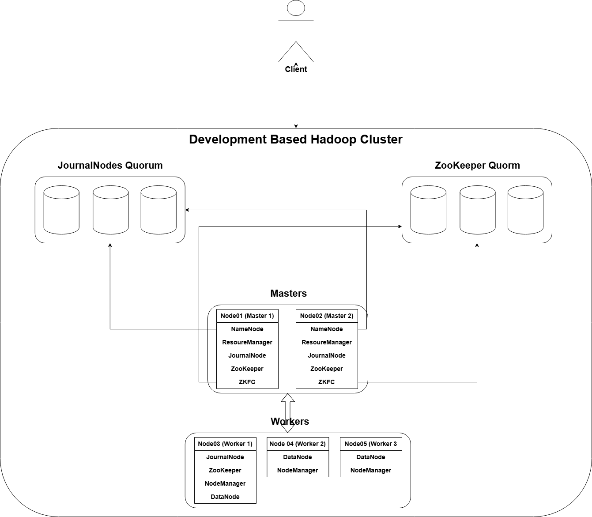

# **Development-based Hadoop Cluster**
- A project for the Hadoop Course provided by the **Information Technology Institute** (ITI) aiming to simulate a **development-grade** Hadoop Cluster consisting of **5 nodes** ensuring **high availability** for all services included with the ability to scale out in the future with ease.

---

## Table of Contents
- [Problem Statement](#problem-statement)
- [Requirements](#requirements)
    - [Functional Requirements](#functional-requirements)
    - [Non Functional Requirements](#non-functional-requirements)
- [High Level Architecture](#high-level-architecture)
- [Design Choices and Trade offs](#design-choices-and-trade-Offs)
- [Deployment](#deployment)
- [Challenges](#challenges)
- [Future Improvements](#future-improvements)

---

## Problem Statement
- We're tasked with setting up and configuring a Hadoop cluster consisting of 5 nodes meant for development purposes, high availability for all services included must be ensured, for HDFS, There must be **two NameNodes (active and standby)** with automatic failover to automatically transfer control from one NameNode to another to ensure minimal downtime of the cluster, However, for YARN, **two ResourceManagers (active and standby)** should also be available in case of the failure of one, another takes over following the same concept as NameNode to ensure job continuity, a replication factor of **1** is also set up in order to ensure **data availability** avoid data loss and in an effort to achieve data locality, making processing much faster, Finally, the goal is to simulate Production-grade cluster resilience and availability for our development Hadoop Cluster.

---

## Requirements
- This section is going to demonstrate the **functional** and **non-functional** requirements of the project.
### Functional Requirements
1. This cluster should be able to run Hadoop on all Nodes, with each Node running specific services (refer to **Design Choices section** for more).
2. This cluster should implement HDFS HA by running two NameNodes (Active and Standby states) and a quorum of JournalNodes, as well as enabling ZooKeeper and ZooKeeper Automatic Failover Controller to make the failover process entirely automatic.
3. This cluster should implement YARN HA by running two ResourceManagers (Active and Standby states) and a quorum of ZooKeeper nodes for automatic failover.
4. This cluster should be able to handle all HDFS processes and requests normally.
5. All files stored on this cluster are subject to a replication factor of 1.
6. This cluster should be able to run all MapReduce jobs submitted to process data stored on HDFS.
7. This cluster exposes a web interface for all services to allow for monitoring.
### Non-Functional Requirements
1. The system shall maintain cluster availability in case of single-node failure affecting NameNodes and ResourceManagers, ensuring that no service is a single point of failure.
2. The system shall ensure metadata consistency between Active and Standby NameNodes using Quorum Journal Manager.
3. The cluster shall recover automatically from service failure without requiring full cluster restart.
4. The cluster deployment shall be reproducible using Docker Compose on any compatible Linux machine.
5. Cluster configuration files shall be organized and documented to allow easy modification and troubleshooting.
6. The architecture shall allow adding additional DataNodes without major architectural changes.

---

## High Level Architecture

---

## Design Choices and Trade offs
- In this section, we outline the key architectural decisions made and discuss the reasoning behind them. Each choice reflects a balance between reliability, performance, and resource constraints within our environment. We also highlight the trade-offs that were necessary — for example, opting for high availability mechanisms that increase complexity but ensure resilience, or setting replication factors that conserve storage while impacting redundancy.

---

## Deployment
- PLACEHOLDER, MIGHT BE REMOVED

---

## Challenges
- This section is going to discuss the challenges faced in the process of setting up and deploying services over the nodes and how they were overcame.

---

## Future Improvements
- PLACEHOLDER